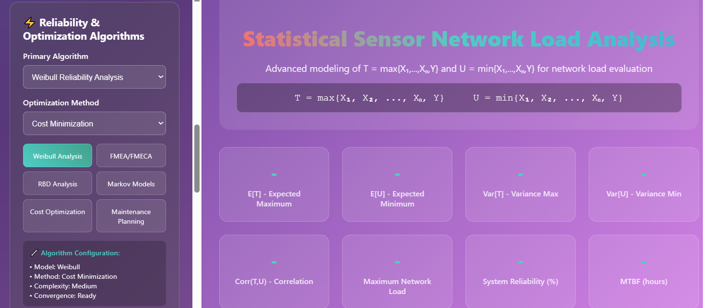
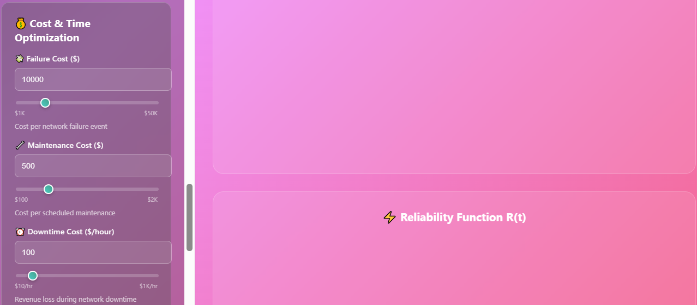

# Statistical-Modeling-Dashboard
probability/statistics
---
Statistical Modeling Dashboard for Sensor Network Load Analysis
---
Overview

This project provides an interactive statistical modeling dashboard designed to analyze the maximum and minimum load in a network of sensors with an additional central sensor.
Independent random variables 

Features

Parameter Configuration
Define distributions 
F(x) and 
G(y), number of sensors 
n, and other statistical settings through an intuitive interface.
Algorithm Flexibility
Choose from a range of statistical and engineering algorithms to evaluate the network load problem.
Data-Driven Analysis
Support for real data input and simulation modes.
Visualizations
Generate a variety of plots and charts (PDFs, CDFs, joint probability heatmaps, etc.) to better understand the model.
Modular Design
Easy to extend with new algorithms, visualizations, or sensor models.

The goal is to compute:

- Marginal densities: \(f_T(t)\) and \(f_U(u)\)  
- Joint density: \(f_{U,T}(u,t)\)  
- Maximum load evaluation for the network  
- Data-driven analysis and parameter estimation  

---

## Features

1. **User-Friendly Parameter Selection**
   - Set the number of sensors (`n`) and distribution parameters interactively  
   - Choose from common distributions (Exponential, Normal, Weibull, Lognormal) or define custom distributions

2. **Statistical Analysis**
   - Compute marginal and joint densities analytically  
   - Monte Carlo simulation for data-driven validation  
   - Parameter estimation using MLE or Bayesian methods
  
     3. **Visualization**
   - Marginal density plots for `T` and `U`  
   - Joint density heatmaps  
   - Simulation results for maximum load evaluation

4. **Algorithm Selection**
   - Choose from a variety of statistical and engineering algorithms  
   - Flexible and extendable for network evaluation or sensor optimization
  
     ---

     
     
